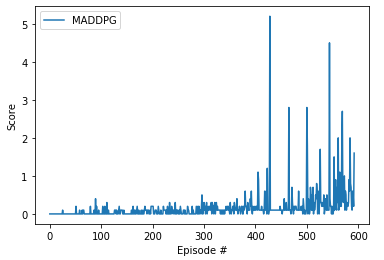

# Collaboration and Competition


## Goal
- To build two deep reinforcement learning agents that continue to play tennis. 
- A reward of +0.1 is provided if an agent hits the ball over the net. 
- A negative reward of -0.01 is provided if an agent lets a ball hit the ground or hits the ball out of bounds.
- At the end of each episode, the higher of the total scores of the two agents is recorded as the score of the episode
- The environment is considered solved when an average score over 100 consecutive episodes reaches +0.5.

## Learning Algorithm

### Multi-Agent Deep Deterministic Policy Gradient (MADDPG) 
I implemented a MADDPG algorithm based on [Lowe et al.](https://arxiv.org/abs/1706.02275). The MADDPG algorithm is a general-purpose multi-agent learning algorithm that:

  1) Leads to learned policies that only use local information (i.e. their own observations) at execution time.
  2) Does not assume a differentiable model of the environment dynamics or any particular structure on the communication method between agents.
  3) Is applicable not only to cooperative interaction but to competitive or mixed interaction involving both physical and communicative behavior. 

Because the MADDPG algorithm is a multi-agent extension of the [Deep Deterministic Policy Gradient (DDPG) algorithm](https://arxiv.org/abs/1509.02971), it shares many features with the DDPG algorithm such as Replay Buffer, Soft Updates, [Batch Normalization](https://arxiv.org/abs/1502.03167.pdf), and Exploration ([Ornstein-Uhlenbeck process](https://journals.aps.org/pr/abstract/10.1103/PhysRev.36.823)). Please refer to the [previous project](https://github.com/ashikagah/DRLND_Continuous_Control/blob/master/Report.md) for the details of those features. 

One of the most important features of the MADDPG algorithm is that each critic receives the actions and state observations from all agents as inputs. This extra information enables **centralized training with decentralized execution**. It utilizes extra information to ease training, so long as this information is not used at test time. It is unnatural to do this with Q-learning, as the Q function generally cannot contain different information at training and test time. Thus, the MADDPG algorithm is a simple extension of actor-critic policy gradient methods where the critic is augmented with extra information about the policies of other agents.

### Hyperparameters
```
LEARN_EVERY = 1         # Learning - timestep interval
LEARN_NUM = 1           # Learning - number of learning passes
GAMMA = 0.99            # Learning - discount factor
LR_ACTOR = 1e-3         # Learning - learning rate of the actor
LR_CRITIC = 1e-3        # Learning - learning rate of the critic
BUFFER_SIZE = int(1e6)  # Replay Buffer - buffer size
TAU = 7e-2              # Soft Update - target parameters
BATCH_SIZE = 128        # Batch Normalization - minibatch size
OU_SIGMA = 0.2          # Exploration - Ornstein-Uhlenbeck noise parameter, volatility
OU_THETA = 0.12         # Exploration - Ornstein-Uhlenbeck noise parameter, speed of mean reversion
EPS_START = 5.5         # Exploration - initial value for epsilon in noise decay process in Agent.act()
EPS_EP_END = 250        # Exploration - episode to end the noise decay process
EPS_FINAL = 0           # Exploration - final value for epsilon after decay
```

### Model architecture
Both the actor and critic networks have two fully connected hidden layers, the first layer with 256 nodes and the second layer with 128 nodes. The actor network uses the tanh() activation function to limit all actions within the [-1, +1] range. When updating the critic network, it uses gradient clipping to place an upper limit on the size of the parameter updates.

## Plot of Rewards


## Ideas for Future Work
Other algorithms such as [Asynchronous Advantage Actor-Critic (A3C)](https://arxiv.org/abs/1611.02247), [Advantage Actor-Critic (A2C)](https://openai.com/blog/baselines-acktr-a2c/), or [Generalized Advantage Estimation (GAE)](https://arxiv.org/abs/1506.02438) should be explored.

