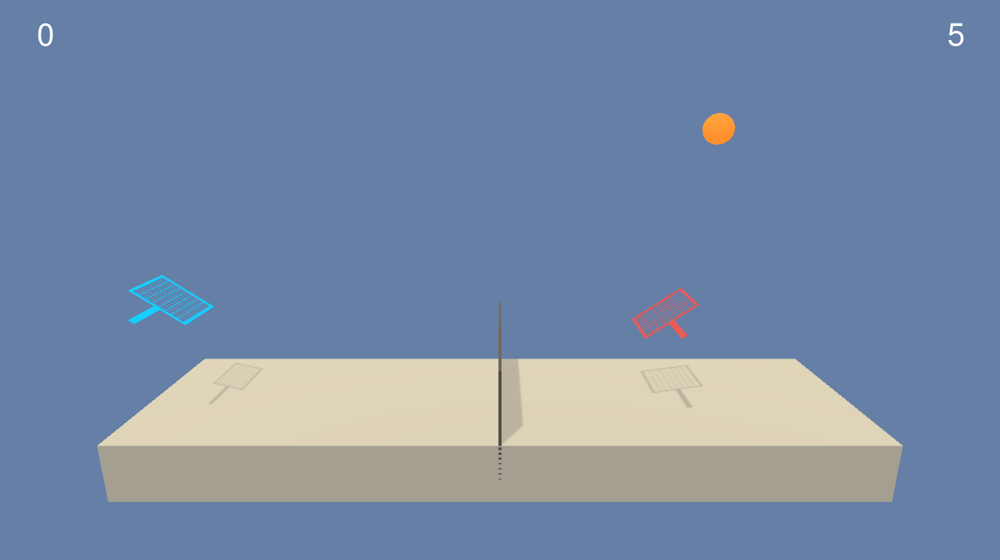

# Collaboration and Competition



## Goal
- To build two deep reinforcement learning agents that continue to play tennis. 
- A reward of +0.1 is provided if an agent hits the ball over the net. 
- A negative reward of -0.01 is provided if an agent lets a ball hit the ground or hits the ball out of bounds.
- At the end of each episode, the higher of the total scores of the two agents is recorded as the score of the episode
- The environment is considered solved when an average score over 100 consecutive episodes reaches +0.5.

## 1. Learning Algorithm
I implemented a Multi-Agent Deep Deterministic Policy Gradient (MADDPG) algorithm based on [Lowe et al.](https://arxiv.org/abs/1706.02275)

The MADDPG algorithm is a general-purpose multi-agent learning algorithm that:

  1) Leads to learned policies that only use local information (i.e. their own observations) at execution time.
  2) Does not assume a differentiable model of the environment dynamics or any particular structure on the communication method between agents.
  3) Is applicable not only to cooperative interaction but to competitive or mixed interaction involving both physical and communicative behavior. 
  
The MADDPG algorithm accomplishes those features by adopting the framework of centralized training with decentralized execution. It uses extra information to ease training, so long as this information is not used at test time. It is unnatural to do this with Q-learning, as the Q function generally cannot contain different information at training and test time. Thus, the MADDPG algorithm is a simple extension of actor-critic policy gradient methods where the critic is augmented with extra information about the policies of other agents.


#### Actor-Critic Method
Actor-critic methods leverage the strengths of both policy-based and value-based methods.

Using a policy-based approach, the agent (actor) learns how to act by directly estimating the optimal policy and maximizing reward through gradient ascent. Meanwhile, employing a value-based approach, the agent (critic) learns how to estimate the value (i.e., the future cumulative reward) of different state-action pairs. Actor-critic methods combine these two approaches in order to accelerate the learning process. Actor-critic agents are also more stable than value-based agents, while requiring fewer training samples than policy-based agents.

What makes this implementation unique is the **decentralized actor with centralized critic** approach from [the paper by Lowe and Wu](https://papers.nips.cc/paper/7217-multi-agent-actor-critic-for-mixed-cooperative-competitive-environments.pdf). Whereas traditional actor-critic methods have a separate critic for each agent, this approach utilizes a single critic that receives as input the actions and state observations from all agents. This extra information makes training easier and allows for centralized training with decentralized execution. Each agent still takes actions based on its own unique observations of the environment.

You can find the actor-critic logic implemented as part of the `Agent()` class [here](https://github.com/tommytracey/DeepRL-P3-Collaboration-Competition/blob/master/maddpg_agent.py#L110) in `maddpg_agent.py` of the source code. The actor-critic models can be found via their respective `Actor()` and `Critic()` classes [here](https://github.com/tommytracey/DeepRL-P3-Collaboration-Competition/blob/master/model.py#L12) in `models.py`.

Note: As we did with Double Q-Learning in the last project, we're again leveraging local and target networks to improve stability. This is where one set of parameters `w` is used to select the best action, and another set of parameters `w'` is used to evaluate that action. In this project, local and target networks are implemented separately for both the actor and the critic.

```python
# Actor Network (w/ Target Network)
self.actor_local = Actor(state_size, action_size, random_seed).to(device)
self.actor_target = Actor(state_size, action_size, random_seed).to(device)
self.actor_optimizer = optim.Adam(self.actor_local.parameters(), lr=LR_ACTOR)

# Critic Network (w/ Target Network)
self.critic_local = Critic(state_size, action_size, random_seed).to(device)
self.critic_target = Critic(state_size, action_size, random_seed).to(device)
self.critic_optimizer = optim.Adam(self.critic_local.parameters(), lr=LR_CRITIC, weight_decay=WEIGHT_DECAY)
```


#### Exploration vs Exploitation
One challenge is choosing which action to take while the agent is still learning the optimal policy. Should the agent choose an action based on the rewards observed thus far? Or, should the agent try a new action in hopes of earning a higher reward? This is known as the **exploration vs. exploitation dilemma**.

In the [Navigation project](https://github.com/tommytracey/DeepRL-P1-Navigation), I addressed this by implementing an [𝛆-greedy algorithm](https://github.com/tommytracey/DeepRL-P1-Navigation/blob/master/agent.py#L80). This algorithm allows the agent to systematically manage the exploration vs. exploitation trade-off. The agent "explores" by picking a random action with some probability epsilon `𝛜`. Meanwhile, the agent continues to "exploit" its knowledge of the environment by choosing actions based on the deterministic policy with probability (1-𝛜).

However, this approach won't work for controlling the tennis agents. The reason is that the actions are no longer a discrete set of simple directions (i.e., up, down, left, right). The actions driving the movement of the arm are forces with different magnitudes and directions. If we base our exploration mechanism on random uniform sampling, the direction actions would have a mean of zero, in turn canceling each other out. This can cause the system to oscillate without making much progress.

Instead, we'll use the **Ornstein-Uhlenbeck process**, as suggested in the previously mentioned [paper by Google DeepMind](https://arxiv.org/pdf/1509.02971.pdf) (see bottom of page 4). The Ornstein-Uhlenbeck process adds a certain amount of noise to the action values at each timestep. This noise is correlated to previous noise and therefore tends to stay in the same direction for longer durations without canceling itself out. This allows the agent to maintain velocity and explore the action space with more continuity.

You can find the Ornstein-Uhlenbeck process implemented [here](https://github.com/tommytracey/DeepRL-P3-Collaboration-Competition/blob/master/maddpg_agent.py#L167) in the `OUNoise` class in `maddpg_agent.py` of the source code.

In total, there are five hyperparameters related to this noise process.

The Ornstein-Uhlenbeck process itself has three hyperparameters that determine the noise characteristics and magnitude:
- mu: the long-running mean
- theta: the speed of mean reversion
- sigma: the volatility parameter

Of these, I only tuned sigma. After running a few experiments, I reduced sigma from 0.3 to 0.2. The reduced noise volatility seemed to help the model converge.

Notice also there's an epsilon parameter used to decay the noise level over time. This decay mechanism ensures that more noise is introduced earlier in the training process (i.e., higher exploration), and the noise decreases over time as the agent gains more experience (i.e., higher exploitation). The starting value for epsilon and its decay rate are two hyperparameters that were tuned during experimentation.

You can find the epsilon decay process implemented [here](https://github.com/tommytracey/DeepRL-P3-Collaboration-Competition/blob/master/maddpg_agent.py#L79) in the `Agent.act()` method in `maddpg_agent.py` of the source code. While the epsilon decay is performed [here](https://github.com/tommytracey/DeepRL-P3-Collaboration-Competition/blob/master/maddpg_agent.py#L150) as part of the learning step.

The final noise parameters were set as follows:

```python
OU_SIGMA = 0.2          # Ornstein-Uhlenbeck noise parameter, volatility
OU_THETA = 0.15          # Ornstein-Uhlenbeck noise parameter, speed of mean reversion
EPS_START = 5.0         # initial value for epsilon in noise decay process in Agent.act()
EPS_EP_END = 300        # episode to end the noise decay process
EPS_FINAL = 0           # final value for epsilon after decay
```

**IMPORTANT NOTE:** Notice that the EPS_START parameter is set at 5.0. For dozens of experiments, I had this parameter set to 1.0, as I had in previous projects. But, I had a difficult time getting the model to converge, and if it did, it converged very slowly (>1500 episodes). After much trial and error, I realized that the agents had some difficulty discovering signal early in the process (i.e., most episode scores equaled zero). By boosting the noise output from the Ornstein-Uhlenbeck (OU) process, it encouraged aggressive exploration of the action space and therefore improved the chances that signal would be detected (i.e., making contact with the ball). This extra signal seemed to improve learning later in training once the noise decayed to zero.

##### &nbsp;

#### Learning Interval
In the first few versions of my implementation, the agent only performed a single learning iteration per episode. Although the best model had this setting, this seemed to be a stroke of luck. In general, I found that performing multiple learning passes per episode yielded faster convergence and higher scores. This did make training slower, but it was a worthwhile trade-off. In the end, I implemented an interval in which the learning step is performed every episode. As part of each learning step, the algorithm then samples experiences from the buffer and runs the `Agent.learn()` method 10 times.

```python
LEARN_EVERY = 1         # learning interval (no. of episodes)
LEARN_NUM = 5           # number of passes per learning step
```

You can find the learning interval implemented [here](https://github.com/tommytracey/DeepRL-P3-Collaboration-Competition/blob/master/maddpg_agent.py#L67) in the `Agent.step()` method in `maddpg_agent.py` of the source code.

##### &nbsp;

#### Gradient Clipping
In early versions of my implementation, I had trouble getting my agent to learn. Or, rather, it would start to learn but then become very unstable and either plateau or collapse.

I suspect that one of the causes was outsized gradients. Unfortunately, I couldn't find an easy way to investigate this, although I'm sure there's some way of doing this in PyTorch. Absent this investigation, I hypothesize that many of the weights from my critic model were becoming quite large after just 50-100 episodes of training. And since I was running the learning process multiple times per episode, it only made the problem worse.

The issue of exploding gradients is described in layman's terms in [this post](https://machinelearningmastery.com/exploding-gradients-in-neural-networks/) by Jason Brownlee. Essentially, each layer of your net amplifies the gradient it receives. This becomes a problem when the lower layers of the network accumulate huge gradients, making their respective weight updates too large to allow the model to learn anything.

To combat this, I implemented gradient clipping using the `torch.nn.utils.clip_grad_norm_` function. I set the function to "clip" the norm of the gradients at 1, therefore placing an upper limit on the size of the parameter updates, and preventing them from growing exponentially. Once this change was implemented, along with batch normalization (discussed in the next section), my model became much more stable and my agent started learning at a much faster rate.

You can find gradient clipping implemented [here](https://github.com/tommytracey/DeepRL-P3-Collaboration-Competition/blob/master/maddpg_agent.py#L128) in the "update critic" section of the `Agent.learn()` method, within `ddpg_agent.py` of the source code.

Note that this function is applied after the backward pass, but before the optimization step.

```python
# Compute critic loss
Q_expected = self.critic_local(states, actions)
critic_loss = F.mse_loss(Q_expected, Q_targets)
# Minimize the loss
self.critic_optimizer.zero_grad()
critic_loss.backward()
torch.nn.utils.clip_grad_norm_(self.critic_local.parameters(), 1)
self.critic_optimizer.step()
```

##### &nbsp;

#### Experience Replay
Experience replay allows the RL agent to learn from past experience.

As with the [previous project](https://github.com/tommytracey/DeepRL-P2-Continuous-Control), the algorithm employs a replay buffer to gather experiences. Experiences are stored in a single replay buffer as each agent interacts with the environment. These experiences are then utilized by the central critic, therefore allowing the agents to learn from each others' experiences.

The replay buffer contains a collection of experience tuples with the state, action, reward, and next state `(s, a, r, s')`. The critic samples from this buffer as part of the learning step. Experiences are sampled randomly, so that the data is uncorrelated. This prevents action values from oscillating or diverging catastrophically, since a naive algorithm could otherwise become biased by correlations between sequential experience tuples.

Also, experience replay improves learning through repetition. By doing multiple passes over the data, our agents have multiple opportunities to learn from a single experience tuple. This is particularly useful for state-action pairs that occur infrequently within the environment.

The implementation of the replay buffer can be found [here](https://github.com/tommytracey/DeepRL-P3-Collaboration-Competition/blob/master/maddpg_agent.py#L196) in the `maddpg_agent.py` file of the source code.

##### &nbsp;

## Results
Once all of the above components were in place, the agents were able to solve the Tennis environment. Again, the performance goal is an average reward of at least +0.5 over 100 episodes, taking the best score from either agent for a given episode.

[Here](https://youtu.be/jOWWzygOi1A) is a video showing the trained agents playing a few points.

<a href="https://youtu.be/jOWWzygOi1A"></a>

The graph below shows the final training results. The best-performing agents were able to solve the environment in 607 episodes, with a top score of 5.2 and a top moving average of 0.927. The complete set of results and steps can be found in [this notebook](Tennis.ipynb).


##### &nbsp;

## Future Improvements
- **Address stability issues to produce more consistent results** &mdash; My "best" results are only reproducible if you run the model numerous times. If you just run it once (or even 3-5 times) the model might not converge. I ran the model at least 30 while searching for a good set of hyperparameters, so perhaps implementing a more systemic approach such as grid search would help. Otherwise, more research is needed to find a more stable algorithm, or to make changes to the current DDPG algorithm.
- **Add *prioritized* experience replay** &mdash; Rather than selecting experience tuples randomly, prioritized replay selects experiences based on a priority value that is correlated with the magnitude of error. This can improve learning by increasing the probability that rare or important experience vectors are sampled.
- **Batch Normalization** &mdash; I did not use batch normalization on this project, but I probably should have. I've used batch normalization many times in the past when building convolutional neural networks (CNN), in order to squash pixel values. But, it didn't occur to me that it would be to this project. This is an aspect of this [Google DeepMind paper](https://arxiv.org/pdf/1509.02971.pdf) that has proved tremendously useful in my implementation of other projects.
  - Similar to the exploding gradient issue mentioned above, running computations on large input values and model parameters can inhibit learning. Batch normalization addresses this problem by scaling the features to be within the same range throughout the model and across different environments and units. In additional to normalizing each dimension to have unit mean and variance, the range of values is often much smaller, typically between 0 and 1.
  - You can find batch normalization implemented [here](https://github.com/tommytracey/DeepRL-P2-Continuous-Control/blob/master/model.py#L41) for the actor, and [here](https://github.com/tommytracey/DeepRL-P2-Continuous-Control/blob/master/model.py#L75) for the critic, within `model.py` of the source code of my previous project. These greatly improved model performance.
